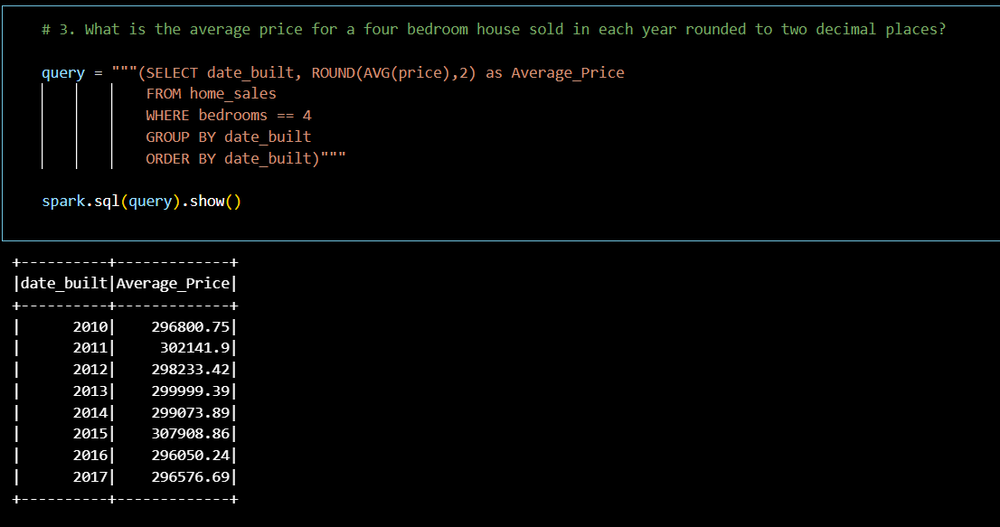

# Home_Sales
Using SparkSQL to determine key metrics about home sales data. 

First we explore the price of a home using different filters, then we look at ratings for the views a home has. 

We then cache the data to explore how that effects the timing of running our query.

Finally, we partition the data and explore how that effects query runtimes.

